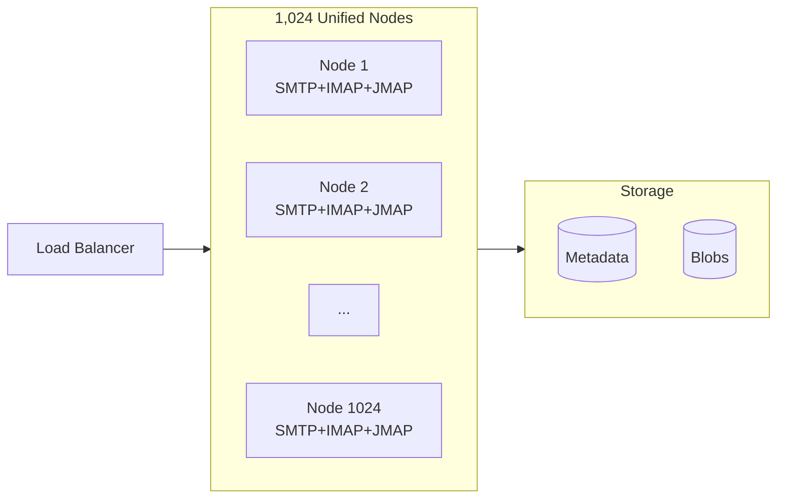
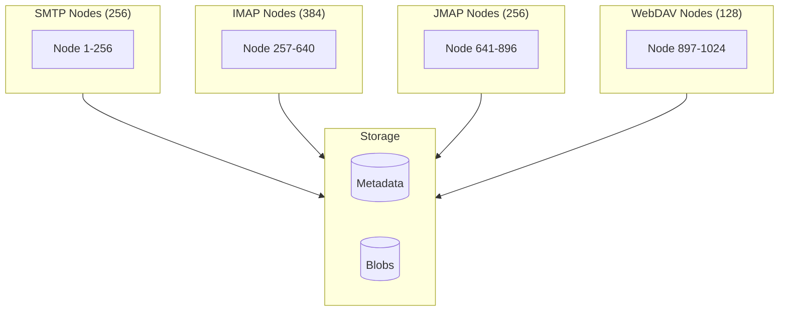
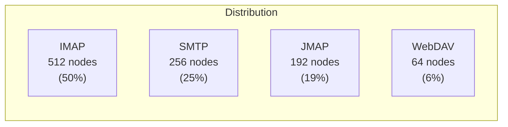
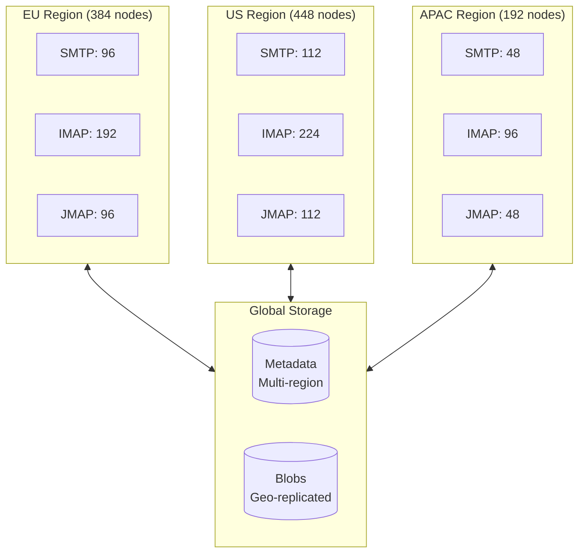

# Topology

In a Stalwart cluster, administrators have full control over how user-facing services are distributed across nodes. This is distinct from [node roles](/docs/cluster/configuration/roles), which assign background maintenance tasks such as purging or certificate renewal. **Cluster topology** focuses on which protocols—such as **IMAP, JMAP, WebDAV, and SMTP**—each node will serve.

Stalwart allows for flexible service distribution: each node can be configured to handle one, several, or all supported protocols. This lets administrators optimize performance, resource usage, and fault tolerance according to real-world traffic patterns and operational goals.

Below are several common topology strategies used in Stalwart clusters:

## Unified Service Model

In this approach, **all nodes in the cluster handle all services**—IMAP, JMAP, WebDAV, and SMTP. For example, in a 1024-node deployment, each server would be configured identically and capable of handling any type of client or protocol request.

This model is ideal for:

* Simpler management and uniform configuration
* Maximizing redundancy (any node can fail without loss of service)
* Smaller or mid-sized environments where service traffic is evenly distributed

The unified model also simplifies load balancing and reduces operational complexity, though it may be less efficient in scenarios where some services see significantly more traffic than others.

## Service-Specific Allocation

In this model, nodes are **dedicated to specific protocols**. For example, a 1024-node cluster might be divided into 256 SMTP nodes, 384 IMAP nodes, 256 JMAP nodes and 128 WebDAV nodes.

This separation of concerns is useful when:

* You want to isolate workloads for performance tuning
* Certain services (e.g., SMTP) need different network access or security policies
* Teams are structured around managing specific services

Service-specific allocation allows more granular resource planning but may require more sophisticated monitoring and load balancing.

## Weighted Allocation Based on Load

Clusters can also be sized **according to expected usage patterns**. For instance, if IMAP usage is significantly heavier than JMAP or WebDAV, the topology could look like this:

| Protocol | Nodes | Rationale |
|----------|-------|-----------|
| IMAP | 512 | Long-lived connections, high memory |
| SMTP | 256 | Burst traffic, queue processing |
| JMAP | 192 | API-heavy, mobile clients |
| WebDAV | 64 | Calendar/contacts, lower volume |

This model strikes a balance between redundancy and efficiency, allocating more resources to higher-demand services while still covering less-used protocols.

It's especially effective in:

* Enterprise environments with known usage trends
* Scenarios where IMAP or SMTP dominate traffic
* Clusters designed to scale incrementally

## Protocol Pairing Model

Some organizations prefer to group **complementary protocols** together. A common configuration might look like:

* 40% of the nodes for **IMAP + JMAP**
* 20% of the nodes for **WebDAV**
* 40% of the nodes for **SMTP Inbound + Outbound**

This model offers:

* Reduced configuration duplication
* Logical pairing of user-facing services (e.g., IMAP and JMAP both serve mail clients)
* Efficient use of resources while still enabling role separation

Pairing services can also simplify routing and firewall policies, especially when grouped by access patterns (e.g., client-facing vs. mail-routing).

## Geographically Distributed Topology

In larger or multi-site deployments, nodes may be distributed across **data centers or geographic regions**, with services colocated according to regional demand:

* Region A: 384 nodes (IMAP, SMTP Inbound)
* Region B: 448 nodes (IMAP, JMAP, SMTP Outbound)
* Region C: 192 nodes (WebDAV, JMAP, SMTP)

This approach improves:

* Latency for users in different regions
* Resilience to regional outages
* Load isolation by physical location

Geographically distributed clusters typically rely on global load balancers, DNS-based routing, or geo-aware proxies to direct traffic efficiently.

## Choosing the Right Topology

There is no one-size-fits-all topology. The best approach depends on your organization’s size, usage patterns, and operational preferences. One of Stalwart’s key strengths is that **topologies are flexible and easily adjusted over time**. You can start with a simple unified model and transition to a more specialized layout as your needs evolve.

Additionally, you can **mix and match** approaches—running unified nodes alongside dedicated ones—or shift services dynamically as demand grows.
