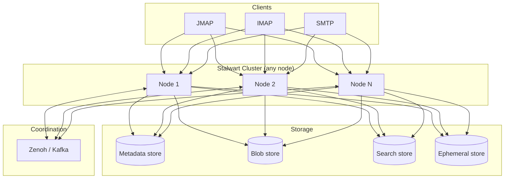

# Overview

Clustering and high availability are central to scalable mail infrastructure. Clustering connects multiple servers so they act as a single system, spreading load and providing redundancy. High availability keeps the service running when individual components fail, minimising downtime.

Stalwart supports clustering and high availability natively. Deployments can range from a single node to thousands of nodes in a high-demand environment. The server recovers from faults automatically, tolerates hardware and software failures, and keeps operating with minimal manual intervention.

Unlike many traditional mail servers, Stalwart does not rely on external directors or proxy servers to route traffic or manage roles. Any node within a Stalwart cluster can handle IMAP, SMTP, JMAP, or WebDAV requests independently. This simplifies deployment, removes single points of failure, and improves horizontal scalability.

In addition to stateless protocol handling, Stalwart supports distributed SMTP queues, so multiple instances process the queue concurrently. Delivery throughput increases and service continues if an individual node becomes unavailable.

## Coordination

Cluster [coordination](/docs/cluster/coordination/overview) describes how nodes share updates, replicate state, and stay informed about the overall state of the cluster. Coordination synchronises data, keeps the cluster consistent, and reacts to dynamic changes such as node joins, failures, or configuration changes.

Stalwart supports two coordination modes. The default is a lightweight peer-to-peer mode that requires no central coordinator or dedicated server. This mode suits smaller or simpler environments where minimal infrastructure overhead is preferred. For advanced deployments or integration with existing infrastructure, Stalwart can also use third-party systems for coordination, including Apache Kafka, NATS, or Redis. These systems offer message persistence and higher throughput, suiting large-scale or mission-critical deployments.

## Orchestration

[Orchestration](/docs/cluster/orchestration/overview) is the automated management of containerised applications: deployment, scaling, health monitoring, and recovery. In a Stalwart cluster, orchestration tools manage the lifecycle of each node and keep the infrastructure healthy and responsive under varying loads.

Stalwart is compatible with orchestration platforms such as Kubernetes, Apache Mesos, and Docker Swarm. These platforms deploy and scale Stalwart nodes, monitor their health, and restart or replace them on failure. Combined with the built-in clustering and coordination capabilities, orchestration keeps nodes available and functional even in dynamic environments.
