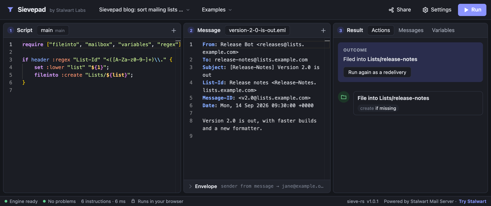
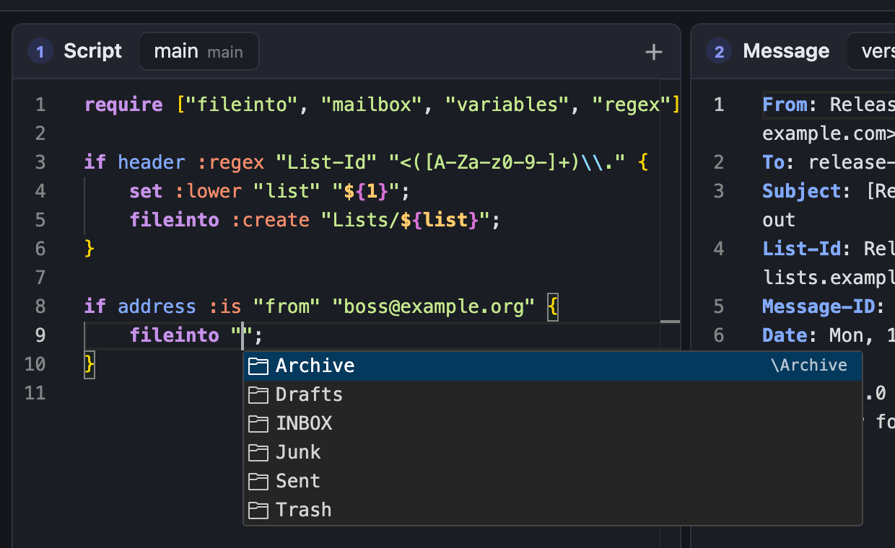
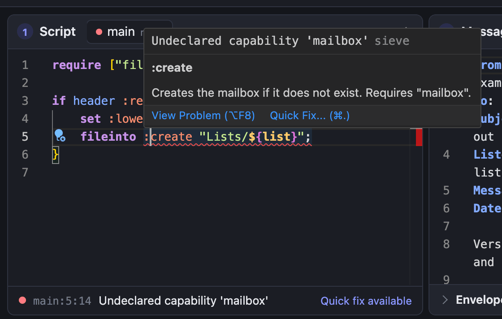

[Sieve](https://www.rfc-editor.org/rfc/rfc5228) is the standard language for filtering email on the server. The rules people create to move newsletters into a folder, flag messages from their manager or answer automatically while on holiday are, on many servers, Sieve scripts, uploaded over [ManageSieve](https://www.rfc-editor.org/rfc/rfc5804) or [JMAP for Sieve](https://www.rfc-editor.org/rfc/rfc9661) and executed every time a message arrives. Stalwart runs these scripts for its users, and administrators use the same language at the SMTP stages to reject, rewrite and route messages before they are accepted.

Sieve was designed to be safe to run on a shared server. The base language has no loops, no variables unless an extension adds them, and no access to the network or the file system. That restraint is what makes it reasonable to let every user of a mail server upload their own filters, but it also leaves nothing to reach for when a filter misbehaves. Today we are releasing [Sievepad](https://sievepad.com), a playground that runs the Stalwart Sieve interpreter directly in the browser, so that a script can be written, run and debugged against test messages in seconds, without a server and without sending a single email.

## Debugging Sieve by email

A Sieve script is not a program anyone runs by hand. The server executes it at delivery time, in response to a message sent by someone else, and the language gives the script no way to report back: there is no print statement, no logging command and no debugger. When a filter does something other than what its author intended, the only evidence is the outcome. The message landed in the wrong folder, stayed in the inbox, or never showed up at all.

Administrators can at least turn to the server logs, which record the actions a script took and any runtime errors it hit, but not the values it looked at or the reason a test failed to match. End users do not have even that. Someone writing a filter in their mail client has no access to the logs, and a script that uploads without complaint can still be wrong in ways that surface only days later, when an important message turns out to have been filed where nobody looked. Syntax errors are the easy case, because the server refuses the upload and says why. The hard cases are the scripts that compile and then quietly do the wrong thing.

Consider a filter that sorts mailing lists into one folder per list, using a regular expression to pull the list name out of the `List-Id` header. It handles every list its owner reads until a new one arrives whose messages keep landing in the inbox. With no way to print anything, the standard technique is to turn the message itself into a debug channel: add `addheader` statements that copy the values in question into the headers, upload the script, send a test email, wait for it to arrive and read its raw source.

```sieve
require ["fileinto", "mailbox", "variables", "regex", "editheader"];

if header :matches "List-Id" "*" {
    addheader "X-Sieve-Debug" "List-Id is ${1}";
}

if header :regex "List-Id" "<([a-z0-9-]+)\\." {
    set :lower "list" "${1}";
    addheader "X-Sieve-Debug" "Matched list ${list}";
    fileinto :create "Lists/${list}";
}
```

{/* sievepad skip: illustrates the debug header technique */}

Getting to this script usually takes more than one round. A first attempt places a debug header only inside the `if`, and the test message comes back without it, which confirms that the condition failed and nothing else. Only the next attempt, which copies the raw header before the test, reveals the value: `Release notes <Release-Notes.lists.example.com>`, with capital letters that the character class `[a-z0-9-]` does not cover.

Each of those questions costs a round trip through the mail system, and some conditions are awkward to set up from an ordinary mail client at all. A rule that depends on the envelope sender, the spam score the server assigns or the current date cannot be exercised just by composing a message. The `vacation` extension answers a given sender only once within its `:days` period, so a second test needs a different sender or a long wait, and `duplicate` exists precisely to detect the second copy of a message. Even the workaround is not guaranteed, since administrators can disable `editheader` for user scripts.

## Meet Sievepad

[Sievepad](https://sievepad.com) is a Sieve playground that runs entirely in the browser. It executes scripts with [sieve-rs](https://github.com/stalwartlabs/sieve), the interpreter inside Stalwart, compiled to WebAssembly. A script is parsed, compiled and run by the same code that runs it on the server, so given the same message and settings it behaves in Sievepad exactly as it does in production, and the errors Sievepad reports are the errors the server would report.

Nothing leaves the browser. There is no account to create and no backend to talk to: scripts, test messages and settings are stored locally, and the interpreter runs in a background worker on the visitor's own machine.



### An editor that knows Sieve

Writing Sieve in a plain text area gets tedious quickly, so Sievepad is built on [Monaco](https://microsoft.github.io/monaco-editor/), the editor component behind Visual Studio Code. The conveniences of a desktop editor come with it: syntax highlighting for scripts and for raw messages, multiple cursors, find and replace, a command palette, and a formatter that re-indents a script in one step.

Autocomplete takes the position of the cursor into account. It suggests commands, tests and tagged arguments together with their documentation, offers extension names inside `require`, mailbox names inside `fileinto` and built-in functions inside Stalwart expressions, and completes the names of variables the script has set inside a `${...}` reference. Hovering over a command or a tagged argument explains what it does and which extension it needs.



The script is compiled while it is being typed. Errors are underlined at the line and column the compiler reports and listed under the editor, so a mistake shows up before the script ever runs. A frequent Sieve error, using an extension without declaring it in `require`, comes with a quick fix that adds the missing declaration.



### Running scripts against test messages

A workspace keeps one or more test messages next to the script, each in its own tab. A message can be pasted in as raw text or dropped onto the page as an `.eml` file, and the envelope sender and recipients can be set independently of the headers. Pressing Run, or Ctrl+Enter (Cmd+Enter on macOS), executes the script against the selected message.

The Result pane shows what happened. Its Actions tab lists every action in order, with the details that matter: the folder a message was filed into and the flags set on it, the address it was redirected to, the reason given for a rejection, or the vacation reply that would have been sent. The Messages tab shows each message the script produced, from the delivered message after `editheader` or `replace` changed it to the vacation replies and notifications it generated. The Variables tab lists global variables and the number of instructions the script executed. When a script fails at run time, the error is marked on the line where it occurred.

Situations that are impractical to reproduce by email take a click. "Run again as a redelivery" runs the script a second time as if the same message had been delivered twice, which is exactly the case `duplicate` is meant to catch. Settings let a workspace stand in for the account a script will run under: its mailboxes and their special-use attributes, the spam and virus scores the server would assign, the current time, external lists, environment values and interpreter limits, all of which can also be edited as JSON.

Sievepad supports the same Sieve extensions as Stalwart, including Stalwart's own `vnd.stalwart.expressions` and `vnd.stalwart.while`, together with the functions that user scripts can call on the server. Functions reserved for system scripts, such as DNS, HTTP and SQL lookups or [LLM prompts](/docs/sieve/llm), depend on services that exist only on the server and are not available.

### Includes, workspaces and sharing

Larger filters are often split across several scripts. A workspace can hold any number of them, and `include` resolves each one by name, so a shared set of rules can be tested together with the scripts that pull it in. Workspaces can be duplicated, renamed, exported to a file and imported again, and the Examples menu opens ready-made workspaces for mailing lists, spam and virus tests, vacation replies, redirects and notifications, includes, and Stalwart's expressions and loops.

A workspace can also be shared as a link. The link carries the workspace, with or without its test messages, compressed into the URL fragment, the part of a URL that browsers never send to the web server. Creating a link uploads nothing, and opening one adds a new workspace to the recipient's browser without touching the ones already there. That makes a link a convenient way to attach a reproducible example to a bug report, a forum post or a support ticket.

## Getting started

Sievepad needs nothing more than a browser:

1. Open [sievepad.com](https://sievepad.com). The first visit loads a short welcome tour, and the Examples menu has more to explore.
2. Write or paste a script into the Script pane. Errors are underlined as the script is typed.
3. Paste a test message into the Message pane, or drop an `.eml` file onto the page, and fill in the envelope below the message if the script tests it.
4. Press Run or Ctrl+Enter and read the outcome in the Result pane.
5. Adjust the script or the message and run it again. When the script behaves as intended, Share turns the workspace into a link.

The mailing list filter from earlier makes a good first exercise. The link below the script opens it together with the `Release-Notes` message, and Sievepad runs it straight away: the Actions tab reports that the message is kept in INBOX. Changing the character class to `[A-Za-z0-9-]` and pressing Ctrl+Enter files the message into `Lists/release-notes` instead.

```sieve
require ["fileinto", "mailbox", "variables", "regex"];

if header :regex "List-Id" "<([a-z0-9-]+)\\." {
    set :lower "list" "${1}";
    fileinto :create "Lists/${list}";
}
```

{/* sievepad
From: Release Bot <releases@lists.example.com>
To: release-notes@lists.example.com
Subject: [Release-Notes] Version 2.0 is out
List-Id: Release notes <Release-Notes.lists.example.com>
Message-ID: <v2.0@lists.example.com>
Date: Mon, 14 Sep 2026 09:30:00 +0000

Version 2.0 is out, with faster builds and a new formatter.
*/}
<p><a href="https://sievepad.com/#w=bVLBTuMwEP2VkcWBFXFwu2glTIUQQouQFg4U7aXuwUmmxcixi8dpEVH-HacJ2q1gTp6Z956fZ9yyLZOTjDldI5NsHrXd6RChsH4t4RZjNG4NFFMNK5YxKoPZRGJy0X5yam1c3_FNKPs84GtjAsJCsZWxaFz0imWgeqAt_NuQbHUwurBIQxpwjamzvFBOObOCZ9QVBpD7eur_MRT5XaVYOs-OF5q_C37Olyc_VIo8lVvlIAVhBGn9LnEVs4m0Zxy1k06xiwHyaQpkGVBHHNXp9KjtCQOwU451y4zVSKTXePDggBY1IXc-IvEtBjLe8SkX3BD3Tcyxtv8P5HfwtYTHgQXXPsJslKCr_kbK8U3XG4t56etL5Z68hIM7vqKUmzfFC5ZRwmIU5g89dAl_Bz8wzQUYguRHuXF6_0zsZWF2QM2_83I_vJ_f3UiYbZPmt45v0hgl3HuXweQM5riBqZj-AnEufwopBJyIFP1mv5rLYGfiM6w0xbSzojG2ItCuAg0Od7DyodYxtfJxITR8ybSQtus-AA" target="_blank" rel="noopener">Try this script in Sievepad</a></p>
{/* /sievepad */}

## Sievepad in Stalwart

Stalwart now links to Sievepad from its documentation and its WebUI. Examples in the [Sieve documentation](/docs/sieve/) that run in Sievepad end with a "Try this script in Sievepad" link, which opens the example together with a test message that exercises it. In the WebUI, the Sieve script editor has a Debug button that opens the script in Sievepad.

Sievepad is open source, and its code lives in the [sieve-rs repository](https://github.com/stalwartlabs/sieve) next to the interpreter it runs. Bug reports and suggestions are welcome there.
