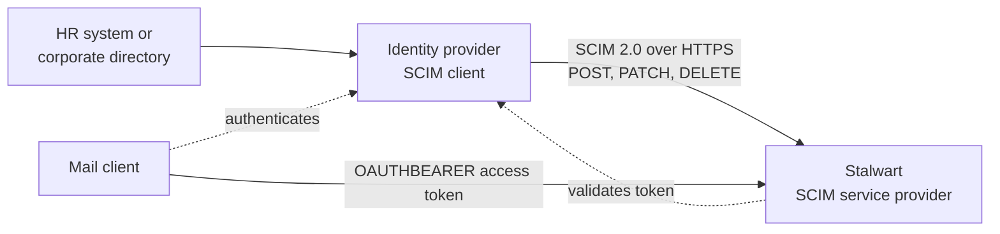

SCIM, the System for Cross-domain Identity Management, is the standard by which an identity provider pushes account lifecycle changes into the applications it governs. When a new employee is created in the corporate directory, SCIM creates the corresponding mail account. When the employee changes department, SCIM updates the group memberships. When the employee leaves, SCIM suspends the account and, if the policy calls for it, deletes it. The protocol is defined by [RFC 7643](https://www.rfc-editor.org/rfc/rfc7643) (core schema) and [RFC 7644](https://www.rfc-editor.org/rfc/rfc7644) (protocol), with the motivation set out in [RFC 7642](https://www.rfc-editor.org/rfc/rfc7642).

Stalwart implements the **service provider** half of the protocol: it receives provisioning requests and applies them to its own account store. It never acts as a SCIM client, so there is no outbound provisioning to other systems, no event feed, and no delivery queue to operate. The whole feature is request and response over the existing HTTP listener, rooted at `/scim/v2`.

:::tip[Enterprise feature]

This feature is available exclusively in the [Enterprise Edition](/docs/server/enterprise) of Stalwart and is not included in the Community Edition. Requests to `/scim/v2` on a Community Edition server are rejected with `403 Forbidden`.

:::

## Roles in the deployment

The identity provider is the SCIM client and the source of truth for identities. Microsoft Entra ID, Okta, Keycloak, and any other conforming implementation can fill that role. Stalwart is the target, and it holds mailboxes, not identities.

The pairing this design assumes is **SCIM together with [OpenID Connect](/docs/auth/backend/oidc)**, not SCIM together with LDAP or SQL. The identity provider owns authentication, so users sign in against it and Stalwart validates the resulting access token. The identity provider also owns the account lifecycle, pushed ahead of first login through SCIM. The account therefore exists before anybody signs in, and it stops working the moment the identity provider says so.

No credential ever crosses the SCIM interface. The published service provider configuration advertises `changePassword` as unsupported and the `password` attribute is absent from the published User schema, because in this topology there is no password for a provisioning client to set. Credentials remain with the identity provider throughout.

## Gaps in just-in-time provisioning

Without SCIM, an OIDC-backed domain relies on just-in-time provisioning: the account is created the first time its owner successfully authenticates. Neither gap can be configured away.

No mailbox exists before first login. A new hire cannot receive mail until they have personally signed in at least once, so messages sent during onboarding are rejected because the address does not resolve to a local recipient. SCIM closes the gap by creating the account at the moment the identity is created in the corporate directory, which is typically days before the first sign-in.

Just-in-time provisioning also never removes anything. It has no way to learn that an account has been deleted upstream, so a departed employee's mailbox persists indefinitely and continues to accept mail. SCIM closes that gap in two ways: `PATCH` with `{"active": false}` suspends the account immediately while retaining its contents, and `DELETE` removes it outright.

A full comparison of the two models, including which one to choose for a given deployment, is given in [Provisioning models](/docs/auth/scim/provisioning).

## Scope

Stalwart provisions two resource types. **Users** map onto individual accounts with their primary address, aliases, display name, locale, time zone, and administrative status. **Groups** map onto group accounts and their membership. Both carry an `externalId`, the identifier the identity provider uses for its own records, which is indexed and filterable so that a client can find a resource it provisioned earlier without storing Stalwart's identifiers.

Beyond the two resource types, the server publishes the discovery endpoints every client probes on connection (`/ServiceProviderConfig`, `/ResourceTypes`, and `/Schemas`), supports bulk operations and query-by-POST, and honours entity tags for optimistic concurrency. The full endpoint list and the limits that apply to each are documented in [Endpoints and protocol support](/docs/auth/scim/endpoints).

Stalwart follows the [SCIM interoperability profile](https://datatracker.ietf.org/doc/draft-zollner-scim-interop-profile/), which removes the freedoms in RFC 7644 that cause clients and servers to disagree, in everything except its rule that undefined attributes must be rejected; see [why undefined attributes are accepted](/docs/auth/scim/provisioning#why-undefined-attributes-are-accepted) for the reasoning, and [schema handling](/docs/auth/scim/endpoints#schema-handling) for what `interopProfileConformant` reports as a result. It also implements the lifecycle requirements of the [IPSIE profile](https://datatracker.ietf.org/doc/draft-schreiber-scim-ipsie-profile/) and cursor-based pagination from [RFC 9865](https://www.rfc-editor.org/rfc/rfc9865).

## Getting started

Setting up SCIM involves three decisions on the Stalwart side and one integration on the identity provider side:

- Which domains the identity provider is allowed to provision, controlled by [`allowScimProvisioning`](/docs/ref/object/domain#allowscimprovisioning) on each [Domain](/docs/ref/object/domain).
- Which account the SCIM client authenticates as, and the [API key](/docs/auth/authentication/api-key) it presents as a bearer token.
- Which permissions that account holds, starting with `scimAccess`.

These are covered in [Configuration](/docs/auth/scim/configuration). The attribute-by-attribute translation between SCIM resources and Stalwart accounts is documented in [Attribute mapping](/docs/auth/scim/mapping), and the procedures for individual identity providers are collected under [Identity providers](/docs/auth/scim/providers/).
