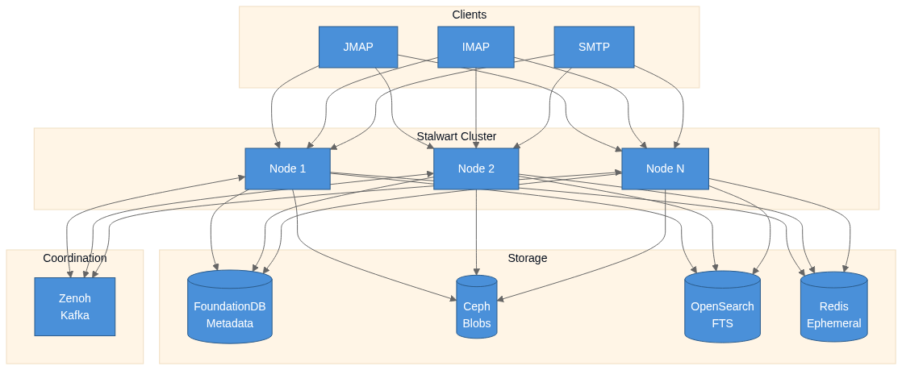
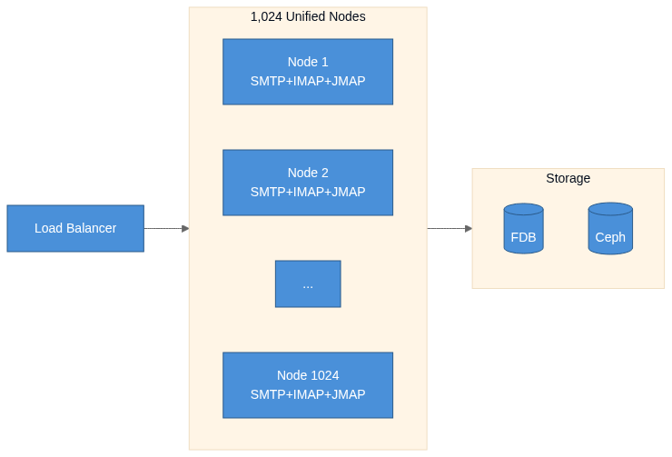
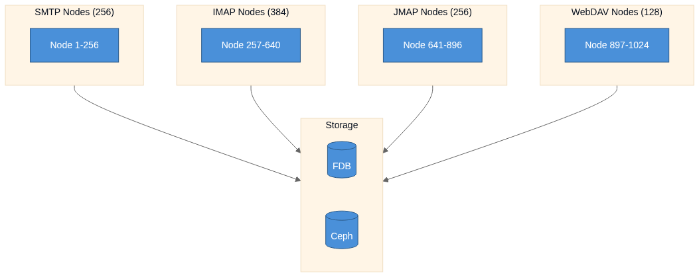
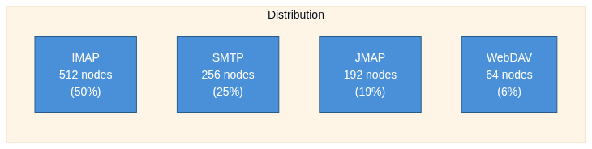
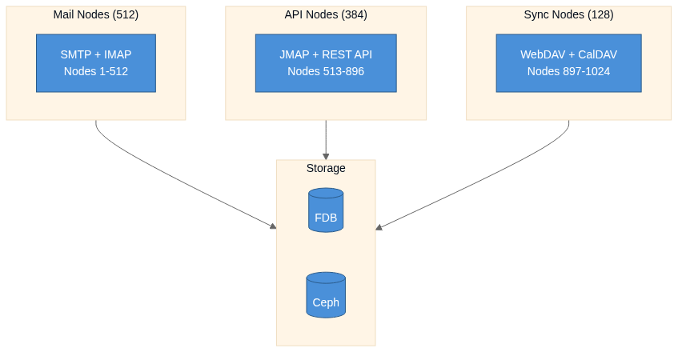
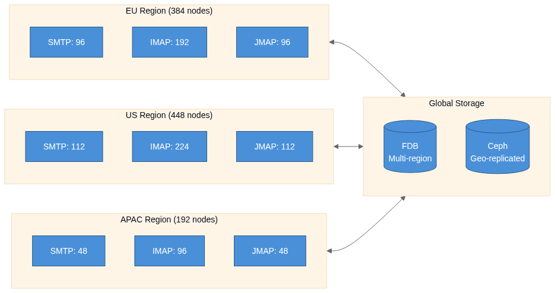

# Stalwart

## Can Open Source do Gmail-scale Email?

FOSDEM 2026

---

## The Challenge

> "We looked at what Google does and thought... how hard can it be?"

**Gmail**: 1.8 billion users, 99.9%+ spam detection

(Spoiler: Pretty hard. But not impossible.)

---

# Gmail's Secret Sauce

| Layer | Technology | Scale |
|-------|-----------|-------|
| **Metadata** | Bigtable + Spanner | Distributed ACID transactions |
| **Blobs** | Colossus | Planet-scale immutable storage |
| **Search** | Per-user indexes | User-sharded, fast lookups |
| **Spam/ML** | Ensemble (TF, RETVec, etc.) | 100M+ blocked daily |

**Key insight**: Separate what changes often (metadata) from what doesn't (message bodies) from what's queried differently (search indexes)

---

## How can we replicate this in open source?

---

# Scaling with the traditional stack
(before Stalwart)

---

# Traditional IMAP Servers
### Problem: The Maildir Format

- Maildir **doesn't scale** in distributed environments.
- No shared storage layer
- The "director" **workaround**:
  - Downloads mailbox from blob store on login.
  - Pins users to specific backend servers.
  - One node becomes "owner".
- **Issues**:
  - Designed for single servers, retrofitted for clustering.
  - Not true horizontal scaling.
  - Single points of failure.
  - Leads to **silos** of users on specific nodes.

---

# Traditional MTAs
### Problem: Local Queues

- Each instance maintains local queue
- No shared queues
- Failover = lost messages
- At scale, leads to **uneven load distribution**

---

# Traditional Spam Filters
### Problem: Bayes Classifiers at Scale

- Bayes classifiers need multiple DB lookups per token
- Per message: ~1000 tokens → ~1000 Redis round-trips
- When using bigrams/OSB, this balloons further
- Per-user models? **Thousands of Redis lookups per message**
- At scale, this becomes the bottleneck

---

<!--
_backgroundImage: none
_backgroundColor: #1a1a2e
-->

# Stalwart

## Built for distributed from day one

**Rust** · **JMAP, IMAP, SMTP** · **AGPL-3.0**

---

# Separation of Concerns

Just like Gmail, four distinct storage layers:

| Store | Purpose | Backends |
|-------|---------|----------|
| **Data** | Metadata, indexes | FoundationDB, PostgreSQL, MySQL |
| **Blob** | Raw messages | Ceph, S3-compatible, filesystem |
| **Search** | Full-text search | Elasticsearch, OpenSearch, Meilisearch |
| **Memory** | Ephemeral data | Redis, in-memory |

---

# Stalwart Cluster Architecture

- All nodes are **equal peers** — no read replicas
- No leaders, no Director
- Users can connect to any node
- Horizontal scaling by adding nodes
- Auto-scaling supported

---

## Stalwart Cluster Architecture

---

# Data Store: Metadata
<!-- _class: lead lead-left -->
Stores headers, flags, thread IDs, folder structure, settings:
 
- **FoundationDB** for distributed deployments.
- Full distributed ACID transactions
- Strict serializability (strongest consistency guarantee)
- Tested at Apple scale (iCloud uses FDB)

---

# Blob Store: Messages
<!-- _class: lead lead-left -->
Immutable email bodies and attachments:
 
- **Ceph** for self-hosted.
  - Extraordinary scalability.
  - Thousands of clients accessing petabytes to exabytes of data.
  - Replicated.
- **S3-compatible** storage for cloud-based.
- No filesystem dependencies = no silos

---

# Search Store: Full-Text Search
<!-- _class: lead lead-left -->
IMAP and JMAP search indexes:
 
- Built-in with **FoundationDB** backend (distributed)
- **Elasticsearch/OpenSearch** (if Java is acceptable)
- **Meilisearch** for smaller deployments (single-node)

---

# Memory Store: Ephemeral Data
<!-- _class: lead lead-left -->
Ephemeral data caching:
 
- **Redis** or **Memcached** backends
- Rate limiting & fail2ban counters
- Distributed locks (queue processing, housekeeping)
- Temporary authentication tokens (ACME, OAuth)
- Lose it on restart? That's fine.

---

# Distributed MTA Queues

- Shared queues across all MTA nodes
- Messages evenly distributed across cluster
- Node failure = no lost messages
- Scales horizontally with cluster size

---

# FTRL-Proximal Spam Classifier

**Follow The Regularized Leader** with Proximal updates

- Online learning algorithm (learns incrementally) from Google research
- Collaborative filtering at scale
- **Hashing trick**: Fixed-size model regardless of vocabulary
- **Cuckoo hashing**: Reduce collisions in large deployments
- Default model size: 2²⁰ parameters = 4MB RAM
- No token → database → score lookup chain

Model loaded once after training, classification is pure computation

**Result**: Classification in microseconds, not milliseconds

---

# Stalwart: Cluster Coordination

- Sharing internal state updates.
- Detection of node joins/leaves/failures in real-time.
- Coordinating distributed tasks across nodes.
- Available mechanisms:
  - Peer-to-Peer coordination with **Eclipse Zenoh**.
  - Distributed event streaming with **Apache Kafka** or **Redpanda**.

---

# Stalwart: Cluster Orchestration

- Automated management of service lifecycle.
- Deploying, scaling, monitoring and recovering application instances.
- Runs in a variety of modern orchestration platforms:
  - **Kubernetes**
  - **Apache Mesos**
  - **Docker Swarm**
- **Proxmox** for on-premise virtualization environments.

---

# Cluster Topologies

How to distribute 1,024 nodes?

---

### Topology 1: Unified Service Model

All nodes handle all protocols

✅ Simple deployment | ✅ Even failover | ⚠️ Resource contention

---

### Topology 2: Service-Specific Allocation

Dedicated nodes per protocol

✅ Optimized tuning | ✅ Isolated failures | ⚠️ Complex routing

---

### Topology 3: Weighted Allocation

Sized by expected load

| Protocol | Nodes | Rationale |
|----------|-------|-----------|
| IMAP | 512 | Long-lived connections, high memory |
| SMTP | 256 | Burst traffic, queue processing |
| JMAP | 192 | API-heavy, mobile clients |
| WebDAV | 64 | Calendar/contacts, lower volume |

---

### Topology 4: Protocol Pairing

Group complementary protocols

✅ Shared resources for related protocols | ✅ Simplified scaling units

---

### Topology 5: Geographic Distribution

Multi-region deployment

✅ Low latency | ✅ Data sovereignty | ⚠️ Cross-region consistency

---

# Choosing a Topology

| Topology | Best For |
|----------|----------|
| **Unified** | Small-medium, simple ops |
| **Service-Specific** | Large scale, protocol isolation |
| **Weighted** | Known usage patterns |
| **Protocol Pairing** | Balanced complexity/efficiency |
| **Geographic** | Global deployments, compliance |

Most deployments: Start **Unified**, evolve to **Weighted** or **Geographic**

---

# How Close Are We?

---

# Metadata Storage

### FoundationDB ✅
- Closest to Google-level infrastructure
- Terabytes to petabytes of data
- Could be sharded to exabyte scale
- **Apple uses FDB for iCloud/CloudKit** 

---

# FoundationDB vs Bigtable + Spanner

| | FoundationDB | Bigtable + Spanner |
|---|---|---|
| **Scale tested** | ~100 TB, 500 cores | 10+ EB, thousands of machines |
| **Transactions** | Full ACID | Bigtable: row-level only; Spanner: full ACID |
| **Consistency** | Strict serializable | Spanner: external consistency (TrueTime) |
| **Transaction limits** | 5s read stale, 10MB | Spanner: effectively none |
| **Open source** | Yes (Apache 2.0) | No |
| **Used by** | Apple iCloud, Snowflake | Gmail, YouTube, Maps |

---

# Blob Storage

### Ceph ✅
- Extraordinary scalability
- Thousands of clients 
- Petabytes to exabytes of data
- Leverages commodity hardware.
- Used by CERN, HP, Wikimedia, OVHcloud

---

# Ceph vs Colossus

| | Ceph | Colossus |
|---|---|---|
| **Architecture** | CRUSH algorithm, no central metadata server | Curators (metadata in Bigtable) + D file servers |
| **Scale** | Exabyte-scale proven | 10+ exabytes, 100x larger than GFS |
| **Replication** | Configurable (replica or erasure coding) | Erasure coding (Reed-Solomon), cross-zone |
| **Interfaces** | Object (S3/Swift), Block, File (CephFS) | Internal Google APIs only |
| **Metadata** | Distributed (RADOS) | Stored in Bigtable |
| **Open source** | Yes (LGPL 2.1/3.0) | No |
| **Used by** | CERN, DigitalOcean, OVH | Gmail, YouTube, Drive, Photos |

---

# Search Store

### Not there yet ⚠️

- **Meilisearch**: great for small deployments, single-node only
- **Elasticsearch**: sharded but not Gmail-scale
- None offer truly Gmail-scale distributed search

---

# Search Store

### Getting there 🚀

- Goals:
  - Distributed architecture
  - Scales with FoundationDB cluster
  - Low operational overhead
- Exploring:
  - **Seekstorm**: Rust full-text search library, faster than Tantivy
  - Currently only file-based storage
  - Project plans to release **FDB-backed** storage

---

# Spam Classifier

### Almost there 🕓

- **FTRL-Proximal** + **Hashing** trick:
  - Scales greatly
  - Very accurate but not as accurate as deep learning
- **RETVec** + **BERT** models:
  - State-of-the-art accuracy
  - Huge computational requirements

---

# Spam Classifier

### Getting there 🚀

- Goals:
  - Match Gmail-level accuracy
  - Deep learning and ensemble models
  - Efficient inference at scale
- Exploring:
  - ONNX Runtime for model inference
  - DistilBERT and quantized models for efficiency
  - Centralized training with distributed model updates

---

# Large-Scale Clusters

### Not there yet ⚠️

- Stalwart has been tested in the lab with:
  - **1 million users** (far away from Gmail's 1.8 billion)
  - **10-node** cluster.
- Additionally, Stalwart is not **v1.0** yet:
  - After ~5 years of development, it is now feature-complete.
  - Focus is now on stability, performance and scalability.
  - Currently in refinement and optimization phase.
  - Many performance improvements planned.

---

# Large-Scale Clusters

### Getting there 🚀

- GitHub awarded Stalwart **$100k in cloud credits**
- Plan: Spin up **thousands of nodes**, millions of messages/sec
- Stretch goal: **simulate 1.8 billion users** (if credits allow!)
- Performance optimizations underway

---

# Large-Scale Clusters

### Roadmap 🚀

- **v1.0.0** release planned for **mid 2026** 🎉
- **Long-term vision**: Make Stalwart as scalable as Gmail
- Even if that means *writing a truly distributed search engine ourselves*!

---

# Summary

**Open source could do Gmail-scale, we're almost there!**
 
| Component | Gmail | Stalwart | Status |
|-|-------|----------|--------|
| Metadata | Spanner / Bigtable | FoundationDB | ✅ Production-ready |
| Blobs | Colossus | Ceph | ✅ Production-ready |
| Search | Per-user indexes | OpenSearch | ⚠️ Works, not ideal |
| Antispam | Ensemble + Deep Learning | FTRL-Proximal | ⚠️ Accurate, not SOTA |
| Clustering | Borg | Kubernetes | ✅ Production-ready |

---

<!--
_backgroundImage: none
_backgroundColor: #1a1a2e
-->

# Questions?

**github.com/stalwartlabs/stalwart**

